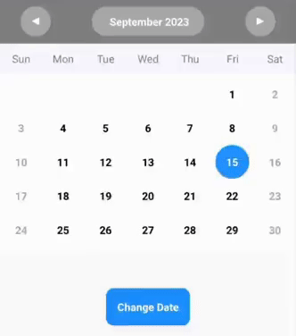

# 📅💀 react-native-deadsimple-calendar 

[](https://www.npmjs.com/package/react-native-deadsimple-calendar )

Need a simple calendar without having to waste time setting up / optimizing?  
Then this package is just for you!




> ***Don't like adding dependencies to your project?***  
> Feel free to copy paste the code from my github & leave a ⭐
 

## Advantages ✨
1. Ready to go out of the box 🚀
2. Highly customizable 🔧
3. Externally changeable date 🪄 
4. Memoized to improve performance ⚡

## Examples

Minimal:
```js
import React from 'react';
import { View } from 'react-native';
import Calendar from 'react-native-deadsimple-calendar';

export default function App() {
  return (<View>

      <Calendar/>

    </View>);
}

```


Customizing:

```js
const MyHeader=()=>(<View>...</View>)


export default function App() {

  const currentDate = new Date()
  const [myDate, setMyDate] = useState(currentDate.getDate())
  const [myMonthYear, setMyMonthYear] = useState({ "month": currentDate.getMonth(), "year": currentDate.getFullYear() })


  return (<>

    <Button title='Change the date' onPress={() => {
      setMyDate(10)
      setMyMonthYear(val => ({ ...val, "month": 2 }))
    }} />

    <Calendar

      selectedDate={myDate}
      setSelectedDate={setMyDate}
      selectedMonthYear={myMonthYear}
      setSelectedMonthYear={setMyMonthYear}

      style={{
        borderWidth: 3,
        borderColor: 'black',
      }}

      // CustomHeader={MyHeader}
      MarkedDates={{ "2023-00-13": [{ color: "red" }] }}

      OnMonthYearChange={(newMonthYear) => {
        console.log(newMonthYear)
      }}

      OnDateChange={(newDate) => {
        console.log(newDate)
      }}
    />
  </>);
}
```

> **Hint 💡**  
> You can use `OnTitlePress` & `setSelectedMonthYear` to create a custom popup to change the month & year.  
>
> ( Check the repo for `/example` )

## List of all Props
| **Props**              | **Type** | **Example**                                                                                                                  |
|------------------------|----------|------------------------------------------------------------------------------------------------------------------------------|
| MarkedDates            | Object   | `{ "2023-00-13": [{ color: "red" }, { color: "green" }] }`                                                                   |
| DaysList               | Array    | `["Sun", "Mon", "Tue", "Wed", "Thu", "Fri", "Sat"]`                                                                          |
| MonthsList             | Array    | `["January", "February", "March", "April", "May", "June", "July", "August", "September", "October", "November", "December"]` |
| OnTitlePress           | Function | `()=>{}`                                                                                                                     |
| OnMonthYearChange      | Function | `(newMonthYear) => {}`                                                                                                       |
| OnDateChange           | Function | `(newDate) => {}`                                                                                                            |
| selectedMonthYear      | useState |                                                                                                                              |
| setSelectedMonthYear   | useState |                                                                                                                              |
| selectedDate           | useState |                                                                                                                              |
| setSelectedDate        | useState |                                                                                                                              |
| style                  | Object   |                                                                                                                              |
| HeaderStyle            | Object   |                                                                                                                              |
| TitleStyle             | Object   |                                                                                                                              |
| RightArrowWrapperStyle | Object   |                                                                                                                              |
| RightArrowStyle        | Object   |                                                                                                                              |
| LeftArrowWrapperStyle  | Object   |                                                                                                                              |
| LeftArrowStyle         | Object   |                                                                                                                              |
| WeekItemsWrapperStyle  | Object   |                                                                                                                              |
| WeekItemstyle          | Object   |                                                                                                                              |
| DayContainerStyle      | Object   |                                                                                                                              |
| DayStyle               | Object   |                                                                                                                              |
| WeekendStyle           | Object   |                                                                                                                              |
| WeekStyle              | Object   |                                                                                                                              |
| DayWrapperStyle        | Object   |                                                                                                                              |
| SelectedWrapperStyle   | Object   |                                                                                                                              |
| MarkerWrapperStyle     | Object   |                                                                                                                              |
| MarkerStyle            | Object   |                                                                                                                              |
| CustomTitle            | Object   |                                                                                                                              |
| CustomRightArrow       | Object   |                                                                                                                              |
| CustomLeftArrow        | Object   |                                                                                                                              |
| CustomHeader           | Object   |                                                                                                                              |
